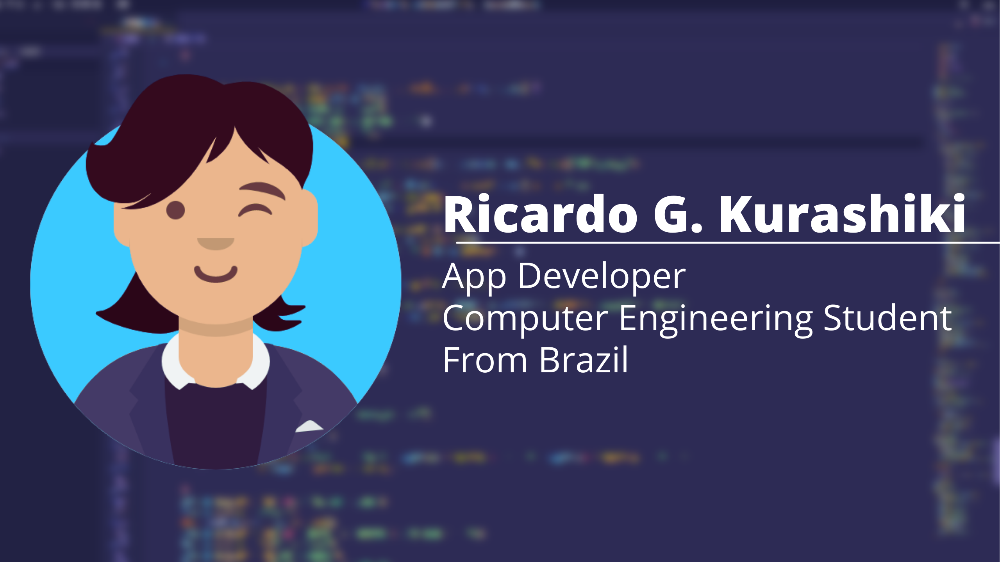

| [English](#en) | [Português](#pt) |

<!--  -->

<h1 id="en"> Hello, I'm Ricardo! 👋</h1>

I'm a computer engineer from <strong>Pontifícia Universidade Católica do Paraná (PUC-PR)</strong>, Curitiba/BR.

I'm a self-taught Flutter developer. Started programming using Dart beginning of 2020 and I'm always trying to improve everyday.

<h2>About me</h2>
<ul>
    <li>💼 Working as a Flutter Developer at <a href="https://www.podiapp.com.br/">Podi</a> since 2021;</li>
    <li>🌱 Learning how to develop games using Godot as a hobby;</li>
    <li>📙 Currently working on my Master's Degree on PUC-PR;</li>
</ul>

<h2>My Interests</h2>
<ul>
    <li>App Development;</li>
    <li>Web Development;</li>
    <li>Game Development;</li>
    <li>Artificial Intelligence (Computer Vision).</li>
</ul>
<!--
<h2>Some projects</h2>

These are some of my projects. Some of them I made while in college, and others were made to learn something new.

I'm always making something, so come back to see more!

<ul>
    <li><a href="https://github.com/RicardoKurashiki/projeto-compilador">Custom Programming Language</a>: A new programming language made for "Linguagens Formais e Compiladores".</li>
    <li><a href="https://github.com/RicardoKurashiki/app_hair">Flutter Architecture Study</a>: An app to study a new approach for project architecture.</li>
    <li><a href="https://github.com/RicardoKurashiki/python-tcc">My final project for college about computer vision.</li>
</ul>
-->

<h2>My Socials</h2>

You can find me at:

- LinkedIn: [Ricardo Godoi Kurashiki](https://www.linkedin.com/in/ricardo-godoi-kurashiki-5236921b1/)
- Twitter: [@RKurashiki01](https://twitter.com/RKurashiki01)

If you want to connect, be free to send a message!

---

<h1 id="pt"> Prazer! Eu sou o Ricardo! 👋</h1>

Me formei em Engenharia de Computação na <strong>Pontifícia Universidade Católica do Paraná (PUC-PR)</strong>.

Sou um desenvolvedor de Flutter auto-didata. Comecei a programar em Dart no início de 2020, e estou sempre tentando aprender algo novo.

<h2>Sobre mim</h2>
<ul>
    <li>💼 Trabalho como desenvolvedor pleno em Flutter no <a href="https://www.podiapp.com.br/">Podi</a> desde 2021;</li>
    <li>🌱 Atualmente estou aprendendo a fazer jogos em Godot como hobby;</li>
    <li>📙 Atualmente fazendo mestrado na PUC-PR;</li>
</ul>

<h2>Meus interesses</h2>
<ul>
    <li>Desenvolvimento de Aplicativos;</li>
    <li>Desenvolvimento Web;</li>
    <li>Desenvolvimento de Jogos;</li>
    <li>Inteligência Artificial (Visão Computacional).</li>
</ul>

<!--
<h2>Alguns projetos</h2>

Alguns dos meus projetos. Uns feitos durante a faculdade, e outros feitos para aprendizado.

Sempre estou criando algo novo, então volte mais tarde para ver mais!

<ul>
    <li><a href="https://github.com/RicardoKurashiki/projeto-compilador">Linguagem de programação nova</a>: Uma nova linguagem de programação feita para a matéria de "Linguagens Formais e Compiladores".</li>
    <li><a href="https://github.com/RicardoKurashiki/app_hair">Estudo de arquitetura de código</a>: Um app criado para aprender uma nova estrutura de arquivos do Flutter.</li>
    <li><a href="https://github.com/RicardoKurashiki/python-tcc">Meu TCC voltado a visão computacional.</li>
</ul>
-->
<h2>Minhas redes sociais</h2>

Você também pode me encontrar aqui:

- LinkedIn: [Ricardo Godoi Kurashiki](https://www.linkedin.com/in/ricardo-godoi-kurashiki-5236921b1/)
- Twitter: [@RKurashiki01](https://twitter.com/RKurashiki01)

Sinta-se livre para enviar uma mensagem!

<h2>Stats:</h2>

